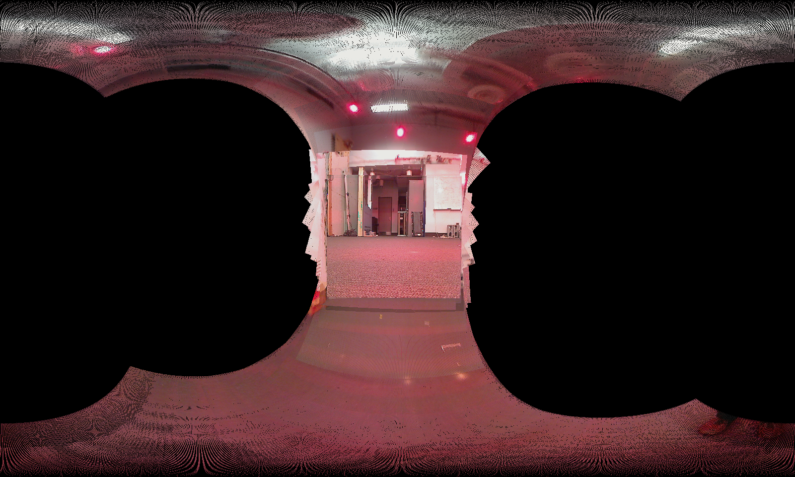
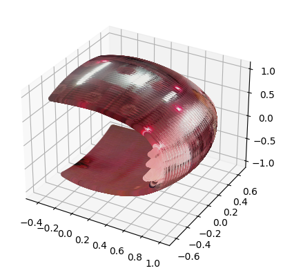

# Panorama and Orientation Tracking

This project is concerned with estimating the orientation of a rotating body using IMU data. These poses are then subsequently used to stitch a panorama.

<!-- Load image outputs/2_pano.png -->
<!-- Center the image -->


# Installation

This project is written in Python 3.8. Install all requirements as follows:

```
pip install -r requirements.txt
```

# Data Format

The data is assumed to be in the format `data` folder. A similar directory structure is expected:

```
data
├── README.md
├── testset
│   ├── cam
│   │   ├── cam10.p
│   └── imu
│       ├── imuRaw10.p
└── trainset
    ├── cam
    │   ├── cam1.p
    ├── imu
    │   ├── imuRaw1.p
    └── vicon
        └── viconRot1.p
```

# Orientation Tracking

Run the orientation script as follows:

```
python orientation_script --scene <scene_number> --split <train/test>
```
This will output an image comparing the ground truth and predicted poses for the train set and predicted poses for the test set in the `outputs/` folder.

# Panorama 

Run the panorama script as follows:

```
python panorama_script.py --scene <scene_number> --split <train/test>
```

This will output an image containing the stitched panorama to `outputs/{SCENE}_pano.png`.


# Code Structure

The files `orientation_script.py` and `pano_script.py` are simply script versions of the notebooks `Orientation Tracking.ipynb` and `Panorama.ipynb` respectively. If you're interested in seeing intermediate results, such as the motion model, observation model, or the 3D sphere used to generate the panorama, check out the notebooks.



# Acknowledgements

This project was done as part of ECE 276A: Sensing and Estimation in Robotics at UC San Diego.